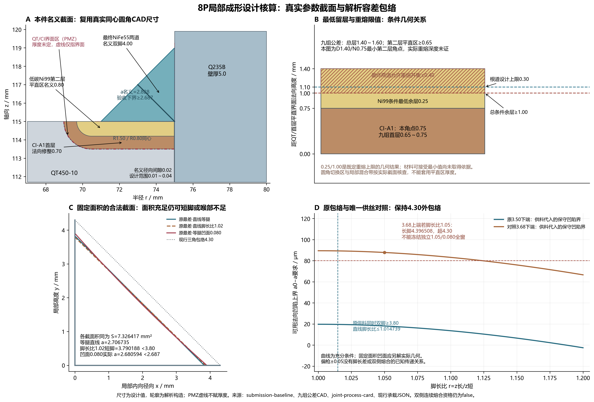

# 8P本件截面与局部成形解析包络

核算日期：2026-10-08。采用现行SUBMISSION-8P源、已完成的九组公差及供料/承载JSON；只运行有限截面算术和绘图，不重算CAD或热—力场。

## 原供料的设计保证范围

现行两道供料截面积为7.326416668～8.760240675 mm²。最低双脚为3.80 mm，现行最低喉部为3.80/√2=2.687005769 mm。面积守恒按局部均匀分配成立时，可支持这些轮廓的填充需求；没有已证的局部轮廓/分配，不能直接取得双脚、有效喉部或熔合保证。

对直线角焊轮廓取S=z₁z₂/2、r=z₁/z₂≥1，则z₁=√(2Sr)、z₂=√(2S/r)，根部至弦的垂距a₀=z₁z₂/√(z₁²+z₂²)=√[2S/(r+1/r)]。

原最差面积下，等腿喉部余量仅19.730 μm。若只检喉部，直线脚长比可到1.187063；同时检双脚≥3.80时，脚长比上界收紧为1.014739151，对应两脚最大差0.056008772 mm。用e=(z₁−z₂)/2表示几何偏心，在固定面积下a₀=S/√(S+e²)，双脚条件要求|e|≤0.028004386 mm。

最低三角有效填充需要7.22 mm²；原最差供料超出仅0.106416668 mm²（1.453%）。若余高、装配间隙下补料、端区或局部铺展另占这部分面积，原等腿最低尺寸假设即失去余量；现有供料JSON未限定这些分配。

## 凹陷与铺展的合法几何

以实际两焊趾连线为弦，实测弦喉距a₀与最大向根部的法向凹陷c满足a几何≥a₀−c；这是充分验收条件。不能把固定面积下的凹陷一律等同于喉部减少c，因为补偿后的脚长会增加。

选取一族明确定义的平滑轮廓P(t)=(1−t)(z₁,0)+t(0,z₂)−4ct(1−t)n，0≤t≤1，n=(z₂,z₁)/√(z₁²+z₂²)。其真实面积S=z₁z₂/2−(2/3)c√(z₁²+z₂²)。脚长按此面积方程解析求解；最短根距由|P(t)|²一阶导数的三次方程驻点及端点求得。数值表是小量指定几何实例，不是供料搜索或实物结果。

等腿时z=(2√2/3)c+√[2S+(8/9)c²]，a几何=√[S+(4/9)c²]−c/3。在原最差面积这一特定凹面族，最大合格凹陷约0.060077906 mm；这个值不能转成任意实际焊缝通用凹陷容差。

| 指定几何实例 | 长脚/mm | 短脚/mm | 实际几何喉部/mm | 双脚≥3.8 | 喉部≥2.687006 | 三角包络≤4.30 |
| --- | ---: | ---: | ---: | :---: | :---: | :---: |
| 原最差·直线等腿 | 3.827902 | 3.827902 | 2.706735 | 是 | 是 | 是 |
| 原最差·直线脚长比1.02 | 3.865991 | 3.790188 | 2.706470 | 否 | 是 | 是 |
| 原最差·直线脚长比1.20 | 4.193256 | 3.494380 | 2.684457 | 否 | 否 | 是 |
| 原最差·等腿凹面0.020 | 3.846805 | 3.846805 | 2.700102 | 是 | 是 | 是 |
| 原最差·等腿凹面0.080 | 3.904070 | 3.904070 | 2.680594 | 是 | 否 | 是 |
| 3.68下端·直线脚长比1.05 | 4.023456 | 3.831863 | 2.774797 | 是 | 是 | 是 |
| 3.68下端·固定面积脚长比1.05/凹面0.080 | 4.101532 | 3.906221 | 2.748823 | 是 | 是 | 是 |
| 3.68上端·直线脚长比1.05 | 4.396508 | 4.187151 | 3.032075 | 是 | 是 | 否 |
| 3.68上端·固定面积脚长比1.05/凹面0.080 | 4.474522 | 4.261449 | 3.006058 | 是 | 是 | 否 |

## 偏枪的设计界限

设备跟踪±0.05 mm控制的是枪轨迹。几何偏心e只有在已知响应关系e=e偏置+Gδ枪时才能传递；原最差供料在零偏置、线性关系的条件下需|G|≤0.560088。本件没有这一传递系数，不能由静态截面或跟踪精度推定短脚合格、双侧熔合或热源资格。

## 唯一局部供丝对照：3.68±0.05 mm/s

其余丝径、沉积效率、速度与道数公差保持现行值，得到S=7.708664494～9.204421892 mm²，等效等腿=3.926490671～4.290552853 mm。下供料角点代入r=1.05并保守扣0.080 mm法向凹陷，喉部下界2.694797006 mm，双脚可支持目标。

上供料角点的直线r=1.05轮廓长脚4.396508384 mm，超4.30约96.508 μm；若保持直线轮廓，允许脚长比最多1.004408545。当前可达性源定义的是x+y≤4.30的三角形，不能仅检两脚≤4.30就接受任意凸面。

若上端将长脚压到4.30、短脚取4.30/1.05=4.095238095，其直线三角面积只有8.804761905 mm²，需额外凸面容纳0.399659987 mm²。对应平滑抛物凸面的法向凸度0.100956613 mm，最大x+y=4.358710178 mm，仍超三角包络。该特定轮廓冲突不证明所有可能轮廓都不可行，但不能支持把独立r≤1.05、c≤0.080当作全供料窗口。

**决策：3.68对照仅为条件候选。原3.50基线不改；3.68下端有几何余量，上端仍需受控轮廓与既有4.30可达性边界共同约束。未经双侧熔合、重熔及热残余验证，不冻结新WPS参数。**

| 名义供丝 | 耗丝/mm | 15%备料/mm | 来丝质量/g | 名义几何下沉积质量/g（η0.90～0.98） | 进入丝焓/kJ（同η） |
| --- | ---: | ---: | ---: | ---: | ---: |
| 3.50 | 610.909091 | 702.545455 | 10.072106 | 9.064895～9.870664 | 11.267665～12.269235 |
| 3.68 | 642.327273 | 738.676364 | 10.590100 | 9.531090～10.378298 | 11.847145～12.900224 |

采用已存NiFe55物性：ρ=8200 kg/m³，20→1470℃的H=1.243000 MJ/kg；由现有Cp分段积分及潜热计算，与已存wire-energy-audit反算一致。潜热和高温Cp为原工程输入，不能代替供方热物性证书。

新增进入丝焓579.479912～630.989238 J，按288 mm实际两道总路径为2.012083～2.190935 J/mm。这些能量须从原净86.4 kJ分配中扣除，余量才进入母材/熔池与损失；不另加第二份热量。电弧300 J/mm名义指令不变，母材截获、双侧熔合与焊态控形资格均未因此取得。

## 材料链、留层与承载接口

名义曲面直接复用QT R1.50、CI-A1同心修整R0.80、法向首层0.70和总深1.50。九组公差的首层法向修整范围0.65～0.75，总平直深1.40～1.60，第二层平直区最低0.65 mm。根道≤0.30、两道重熔并集≤0.40是现有设计控制值，实际深度未取得验证。此条件下第二层几何余层≥0.25、总几何余层≥1.00 mm；这些是几何预算结果，未被文献或有效接头证据证明为冶金/裂纹/容量最小安全厚度。

0.30 mm根道限值的原依据是声明密度与平直接触宽度下均匀混合筛查：Ni过渡层来源比例最差0.191019，低于先设的20%诊断输入。不能用此反向证明实际稀释。PMZ仅以QT/CI界面虚线标注，实际厚度、组织及容量未赋值。圆角切换区不套用平直区最低厚度。

沿用128 mm有效长度和2.687006 mm有效喉部时，现有名义静承载需求为42.249313 MPa。本件截面计算只检查容量输入能否获得几何支持，没有重算或授予材料容量。current-section-interface中的旧3.50 mm喉部只保留其历史来源，现行喉部取submission-baseline和delivery-joint-capacity。

## 可执行轮廓验收指令

1. 定义截面虚拟根为实测钢内壁与加工后座体上平面的交点；记录0.01~0.04 mm间隙，先标定两侧实际熔合边界。
2. 稳定16 mm范围各段起/中/末分别记录两脚、轮廓、根部与两侧熔合；端区各1 mm另检，不计入128 mm承载长度。
3. 双脚测量下界zi_meas-Uzi>=3.80 mm；实际自由面每一点均位于x+y<=4.30 mm外包络内（含外向不确定度）。
4. 从确认的根部到实际自由面求最短距离；a_geom_meas-Ua>=2.687006 mm。若用弦距/凹陷法，需a0_meas-c_meas-Ucombined>=2.687006。U由实际方法资格确定，不臆设为零。
5. 喉部区域还须双侧连续熔合、无裂纹/未熔合及不可计承载缺陷；几何喉部合格后再登记有效喉部，不以静态图或总增重授予融合资格。
6. 同截面记录CI-A1修整留层、Ni99加工后厚度及根道/两道时域并集的实际重熔；0.30/0.40为待确认设计上限，0.25/1.00仅是其条件几何余层。
7. 总增重/耗丝与局部轮廓分别记账。偏枪、丝速、总质量或等效焊脚不能替代短脚、凹陷、实际喉部和熔合检验。

## 运行和来源

实际运行：`python studies/COMPETITION-DESIGN/delivery_section_envelope.py`。同名JSON保存完整输入引用、公式、角点、质量与焓。图的PNG/SVG/PDF均由本脚本生成。没有生成实测照片、组织图、熔合数据或额外候选矩阵。

正文用图追加拆分输出：`python studies/COMPETITION-DESIGN/delivery_section_envelope.py --split-figures-only`，直接读取已算JSON，生成同源`-AB`（材料截面＋条件留层）和`-CD`（局部轮廓＋供丝边界）两张PNG/SVG/PDF，约160 mm印宽使用。原四面板图保留为附件；拆分未重算数值或改变决定。

- `project/submission-baseline.yaml`
- `project/precoat-process-design.yaml`
- `deliverables/process/joint-process-card.json`
- `cad/generated/independent-precoat-curved/geometry-audit.json`
- `cad/generated/precoat-tolerance-family-20261007/geometry-and-feed-audit.json`
- `studies/COMPETITION-DESIGN/results/delivery-joint-capacity-20261008.json`
- `studies/COMPETITION-DESIGN/results/current-section-interface.json`
- `src/hanjie/domain/tooling_access.py:83`
- `simulation/competition-r4/results/explicit-ni99-wing285-r749-z11535-w08-d05-t14-h15-lh05-dt0125-i05-hot1470/input.json`
- `simulation/competition-r4/results/explicit-ni99-wing285-r749-z11535-w08-d05-t14-h15-lh05-dt0125-i05-hot1470/wire-energy-audit.json`
