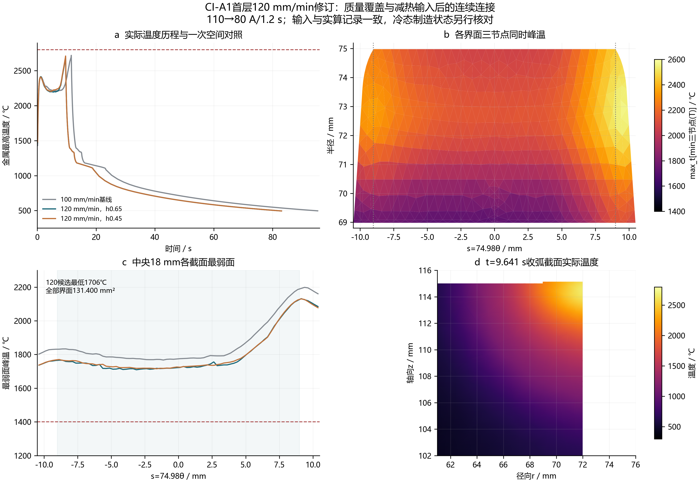

# CI-A1首层减热输入设计修订卡

适用对象：八翼开口创新候选的历史提速比较。当前保持100 mm/min设计基线，120 mm/min不进入本次主工艺；完整圆环基准不继承此卡的热连接结果。

对象为壳体外的QT450-10八翼座体。现有R1.5预制槽、首层法向保留0.70±0.05/R0.80、低碳Ni99第二层和最终8P组焊接口保持原设计。本卡只评估将首层焊速由100提高至120 mm/min，生产参数在完整连续熔合、冷态存留与后序制造验证后确定。

| 控制项 | 100 mm/min基线 | 120 mm/min修订 |
| --- | ---: | ---: |
| CI-A1焊条 | Ø3.2，DCEP | 相同 |
| 稳态/末端电流 | 110/80 A，末段1.2 s线性缓降 | 相同 |
| 工作弧压与工程效率 | 23 V，η=0.8 | 相同 |
| 每翼连续主弧 | R71.98，19.281695 mm | 相同 |
| 实际弧燃 / s | 11.569017 | 9.640848 |
| 稳态净线能量 / J/mm | 1214.4 | 1012.0 |
| 缓降积分净热 / kJ·翼⁻¹ | 23.084491 | 19.181876 |
| 供料质量 / g·翼⁻¹ | 1.916154 | 1.588366 |
| 冷态质量等效体积 / mm³·翼⁻¹ | 215.540430 | 178.668796 |
| 槽顶以上等效余高 / mm | 0.452379 | 0.132225 |

供料采用已登记的0.17 g/s稳态和末段I²低供料情景。令r=80/110，缓降少供料的等效时间为Δt=1.2[1−(1+r+r²)/3]。每翼供料m=0.17(L/v−Δt)，净热Q=0.8×23[110(L/v−1.2)+(110+80)×1.2/2]。120候选进入焓1.985457 kJ已经包含在19.181876 kJ内，余下体积源热17.196419 kJ，不再乘一次效率。

实际CAD槽容积163.440577 mm³，按当前冷态密度8.89 mg/mm³，填满整槽至少需要1.452987 g。在0.17 g/s、给定末段供料式及名义槽条件下，零余高焊速上限为130.804629 mm/min。它随供料、密度和实际槽体积变化。按当前填槽包络直接提速至200 mm/min时，名义供料仅0.932788 g，少于完整槽所需质量约0.520199 g。120候选名义总量余量0.135379 g，单翼净热降低16.91%；等效余高由真实CAD体积确定。

供料、焊速和槽体积须联立满足q下限×[L/(v名义×(1+ε上限))−Δt]≥ρ上限×V槽上限。120 mm/min在名义槽及密度下要求稳态供料至少0.155511 g/s，这只是算出的必要值，尚无称量证据把它作为保证下限。历史0.15～0.333333 g/s为工程敏感性区间，不能临时缩窄。0.15 g/s情景下，120仅供1.401499 g，欠0.051488 g；相同情景的条件零余高速度上限为115.874426 mm/min。

| 供料 / g·s⁻¹ | 速度 / mm·min⁻¹ | 槽体积条件 | 填槽质量余量 / g |
| ---: | ---: | --- | ---: |
| 0.17 | 120 | 真实名义R1.5 CAD | +0.135379 |
| 0.15 | 120 | 真实名义R1.5 CAD | −0.051488 |
| 0.17 | 120 | 平面面积不变、均匀加深0.10 mm的条件估算 | +0.032994 |
| 0.17 | 122.4 | 上述加深估算，再叠加速度+2%敏感性 | +0.000858 |

首层速度公差尚未冻结，表中+2%不作为既定允许偏差；槽深1.50±0.10 mm沿用图纸，均匀加深估算为历史条件估算；现已另完成真实CAD公差族，见HJ-W-00E。生产窗口须由实际槽体积上界、密度/供料下界及速度上偏差联合确定，不能用最后一行接近零的余量冻结参数。

质量等效包络用于闭合投入量与计算几何。车间首件按槽底基准记录全翼、两端和R1.5转角轮廓：首层应覆盖完整实际槽，并在最大0.75 mm法向保留包络之外具有连续可切削余量，不能以平均余高验收局部薄区。若端部欠填、夹渣或裂纹进入保留层，则该设定不进入后序。最终孔仍在两层预制及修整后加工，组焊后的径向微珩上限仍为3 μm。

验证执行顺序为完整单弧→全界面热连接与温区→冷态残余状态→真实0.70±0.05/R0.80去料再平衡→第二层。120候选使用原有效热源宽3.2 mm和液态输运参考因子3，没有按峰温重新调宽或提高温度守卫。体积源深度按同一质量包络规则由1.952379降至1.632225 mm，源中心随实际填充前沿更新；新旧工艺的温度和重熔差异包含这一几何联动。有效源尺度与CI-A1实际焊道的工艺确认同时进行；源尺度不是枪距或厂家给定熔深。

派生有效源深下降16.398%，最终源锚点z由115.452379变为115.132225 mm。本比较采用相同包络—热源规则，实际源空间输入随几何改变；净热降幅有独立积分依据，预测的液化深度变化同时包含源深和锚点变化。

已实际完成一翼连续弧及冷却至约494.4℃，随后完成唯一h0.65→h0.45空间对照。逐面以三个P1顶点在同一时刻均≥1400℃的判据核对，不拼接各顶点独立峰值。结果如下。

| 热响应 | h0.65 | h0.45 | 相对差 / % |
| --- | ---: | ---: | ---: |
| 逐面达到判据的全界面面积 / mm² | 131.399993 | 131.551556 | 几何面积差0.115 |
| 中央18 mm最弱面整面峰温 / ℃ | 1706.040 | 1714.997 | 0.522 |
| 金属峰温 / ℃ | 2698.882 | 2710.270 | 0.420 |
| QT峰温 / ℃ | 2567.173 | 2580.049 | 0.499 |
| QT曾液化区最大观察深度 / mm | 7.250665 | 7.307872 | 0.783 |
| 界面质心最终t8/5范围 / s | 50.377832～52.680259 | 50.380463～52.665570 | 端点最大0.028 |

两套网格均覆盖中央18 mm全宽连续区及全部界面；最大关键空间响应差0.783%≤5%，至此停止热响应细化。1400℃为当前材料表的两侧液相线最大值，面积为各面分别达到判据后的累计面积，不表示全焊缝在同一时刻液化。凝固域采用0.125 s步长；新候选尚未完成独立时间对照，不直接继承100基线全部离散资格。

同为h0.65、0.125 s凝固冷却记录的100基线曾液化观察深度8.163961 mm，新候选为7.250665 mm；这是未标定体积源下的条件预测，不等同实际稀释、PMZ宽度或实测熔深。质量步误差≤2.09×10⁻¹³ g、逐步能量相对差≤2.52×10⁻⁷，进入焓与净热分账闭合。

本轮决定：保留120作为减热输入条件候选，暂不采用为生产窗口。热连接空间筛查通过；公差实体已完成，供料窗口尚未取得可靠下界；冷态机械制造状态未取得，真实修整、第二层存留、最终卸夹孔轴和同状态承载仍未完成。0.25 s原生故障时Ni尚未接入，提速不被宣称能修复该表示；本轮停止新增求解变体，也不把120热场自动投入该失败路径。

道前/层间200～300℃、对向焊序1→5→3→7→2→6→4→8、壳外清渣、200℃保温2 h及50℃/h炉环境缓冷均沿用独立预制制度。单翼减少1.928169 s弧燃，不能把这一节省等同于整线节拍改善；首层炉冷、第二层、加工和延迟检查仍按实际占用核算。

计算输入：[120候选参数](../../project/precoat-speed120-candidate.yaml)、[质量—热量核算](../../output/review/first-precoat-speed120-20261007/speed-volume-energy-screen.json)、[供料窗口核算](../../output/review/first-precoat-speed120-20261007/speed120-supply-window.json)、[热连接空间对照](../../output/review/first-precoat-speed120-20261007/speed120-thermal-comparison.json)、[实际质量闭合CAD](../../cad/generated/mma-mass-envelope/CI-A1-single-track-speed120-end80-r12-h065/first-mass-envelope.step)。焊条电流范围按[KOBELCO原厂目录](https://www.kobelco.co.jp/products/welding/pdf/catalog.pdf)执行；0.17 g/s及末段供料式由首件称量和轮廓核验后固化。

真实槽深/R/留层公差族已完成九实体，最大槽176.157710 mm³/翼，设计密度填槽需1.566042 g。120的实际最大槽必要供料0.167611 g/s，速度+2%情景需0.171072 g/s；0.15 g/s情景欠0.164543 g，0.17 g/s及+2%情景欠0.009813 g。因此保持条件候选、不替换100基线。真实公差实体没有执行带残余历史的切削。
