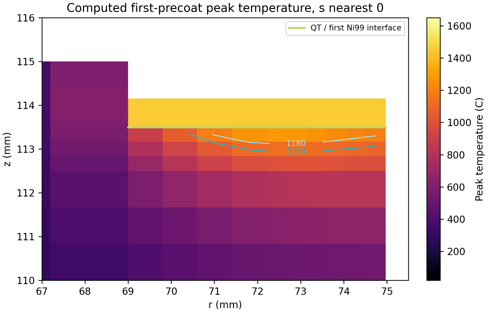
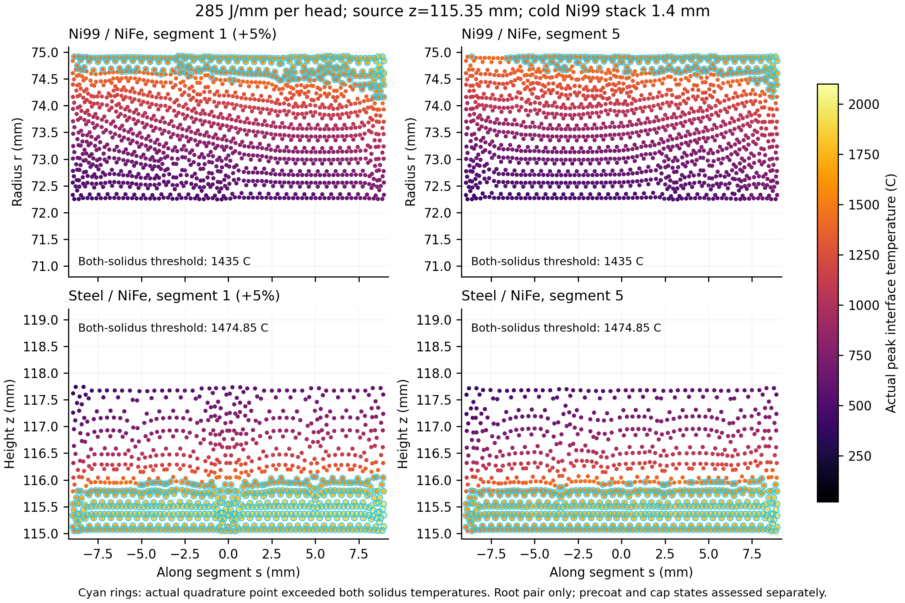
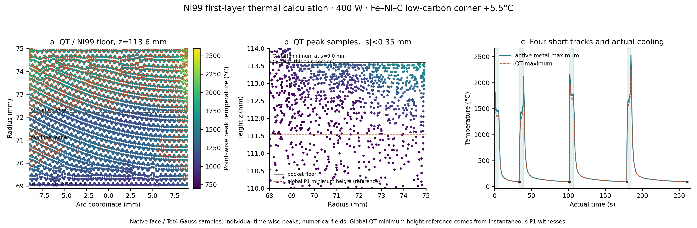

# 本地续算与Ni99实体连接记录

本地工作从adae2646cc999bb4c48248d0bd84b85c6a64fd4f继续。此前停止/云端交接记录保留为历史记录；新的本地续算指令已撤销停止要求。没有创建云端任务、定时监控或新的聊天。

## 1. 实际恢复的计算

仅恢复`8p-E285-k2500-f2-bore008-h1125-dt0125-s025`，从30.4090909091 s已收敛检查点继续。恢复时网格、输入及全部状态核对一致；原停止检查点另存`stopped-checkpoint-20261005.npz`，既有交接ZIP未改写。另两组加密算例仍保留原停止状态。

每头净功率470.25 W、焊速1.65 mm/s，即285 J/mm；保持5%头间热不平衡、8P、两道、对向顺序和两倍工装热域。胀套刚度密度2500 N/mm³；孔上界40.008 mm；h1.125、Δt0.125 s、结构步0.25 s。微珩路线热变形预算仍为13.5 μm。

整件基准已实际推进到68.4431818182 s；随后实体镍层的首对根道结果明确暴露QT侧未熔合，因此保留`fusion-revision-checkpoint-20261005.npz`并暂存旧模型，不再优先耗时完成其冷态形变。其工作进程已结束；这是依据新物理证据调整计算路线，并非恢复此前的用户停止要求。计算资源转入实体连接热源修订。

## 2. 齐平层厚与送丝闭合

浅槽深1.50±0.10 mm，镍层最终加工到与QT面齐平，所以实际总厚应为1.40～1.60 mm。原“总厚≥1.20”仅为隔离层底限，不能定义齐平几何。

原7.4/11.3 mm/s、棒径1.20、焊速2.0及沉积效率0.90～0.98的新增厚分别约0.628～0.683和0.958～1.044 mm。最小总厚1.586 mm，小于最大槽深1.60，存在0.014 mm欠填。新增工序要求为逐槽测量≥0.10 mm正余高；第二层12.70 mm/s调整初值给出1.077～1.173 mm，最小总新增厚1.705 mm，对最大槽深留0.105 mm余高。实际覆盖宽、棒径、熔深与余高按首件/批次截面和轮廓确认。

已同步HJ-W-00、HJ-002及说明书§1.2/自动化前工序；HJ015/HJ016的隔离盘和筒式撤出尺寸不受此改动影响，因为成品连接面仍为z115。

## 3. 共节点实体连接几何

`explicit_joint_mesh.py`生成五种实体：Q235、QT、NiFe、首层Ni99、第二层Ni99。Ni99从QT浅槽中置换体积，保持总成外形；界面采用共享节点，未用弹性连接刚度冒充镍层塑性。

| 已生成网格 | 节点 | 四面体 | 说明 |
| --- | ---: | ---: | --- |
| h1.5/layer0.5/circle400 | 562890 | 2476918 | 初版没有根道内部界面，且短边尺寸向整体传播，保存为几何试算 |
| h1.5/layer0.5/field | 127958 | 551104 | 根道2.8/盖面4.0几何分别分割，内部尺寸由距离场控制 |

第二组QT原体积138366.516823 mm³；Ni99首/第二层体积541.423666/696.587766 mm³；置换后的QT为137128.505391 mm³。置换闭合误差约−1.28×10⁻⁹ mm³。实体层总厚1.5、首层0.656、第二层0.844、加工面z115。原首轮PLC曲面相交错误及后续过密网格均保留；新网格限制粗尺寸≤2.4 mm，并关闭短边向体内部的无控制传播。

`run_explicit_joint_thermal.py`已用第二组网格完成285 J/mm首对根道的整件热计算，含两层镍的热容、导热和熔化焓。弧燃10.9090909091 s，输入10260 J，耗时646.765 s；最高节点/单元平均峰温1520.625/1478.934℃。实际Ni99—NiFe界面节点峰温上界仅960.707℃，低于第二层1435℃固相线；P1插值下界面任一点的时间峰值不可能超过其节点峰值上包络，故本次首对根道的QT侧熔合不存在。钢—NiFe界面最高1488.919℃，超过1474.85℃固相线的面片面积上界3.079 mm²；不是已证明的连续熔合面积。

由此不能把旧模型的孔形当作可采用工艺。保持285 J/mm后，将源中心从R74.8/z116.2调整为R74.9/z115.35的焊根瞄准候选，Gaussian宽/深从1.27017/0.92376改为0.8/0.5 mm，实际已启动同一实体网格复算。源集中度是待验证的工艺输入，必须结合双侧熔合、累计重熔≤0.40、材料/源敏感性及空间/时间精度共同选定。此阶段未给Ni99或QT-PMZ指定断裂容量，也未将预制残余状态清零后用于承载判定。

## 4. 首层Ni99的实际局部热计算

`ni99_local_thermal.py`为三维柱坐标有限体积模型，s=75θ；显式槽底、首层、第二层和父材料，包含温变导热、显热、潜热、对流及辐射。焊丝进入焓从净电弧功率中扣分配，保持总输入能量。首层熔点及导热缩放为材料敏感性输入，未由热峰值推定PMZ组织比例或强度。

初版在9 s终点因浮点余数产生约10⁻¹⁴ s伪时间步而停算；修正事件端点后9 s弧燃计算收敛，失败输出保留。高温区及焊丝焓分配结果如下；热源宽/深为Gaussian的1/e尺度。

| 热计算 | 净功率W | 宽/深mm | 首层厚mm | QT峰温℃ | 首层峰温℃ | 单步能量闭合最大误差J |
| --- | ---: | --- | ---: | ---: | ---: | ---: |
| 初始宽道，冷态出生 | 616 | 2.2/1.6 | 0.656 | 1572.19 | 1618.32 | 1.37e−10 |
| 降功率宽道，冷态出生 | 308 | 3.0/0.6 | 0.656 | 763.35 | 877.20 | 1.60e−10 |
| 较高功率宽道，冷态出生 | 400 | 3.0/0.6 | 0.656 | 996.52 | 1132.92 | 1.43e−10 |
| 焊丝1450℃进入，扣除其焓 | 520 | 3.0/0.6 | 0.656 | 1299.37 | 1471.32 | 1.26e−10 |
| 厚首层候选R73，热态焊丝 | 600 | 3.5/0.6 | 0.830 | 1444.04 | 1691.55 | 1.31e−10 |
| 厚首层候选R73，含停弧20 s | 500 | 3.5/0.6 | 0.830 | 1251.21 | 1458.20 | 6.31e−4 |

520 W试算中，QT峰温≥1180℃的体积12.733 mm³，1100～1180℃区13.062 mm³。假定这些熔化体积全部卷入时，QT质量占比的条件范围约13.2%～23.6%；它是熔化体积的混合需求筛查，不能当作流动混合已求出的实际稀释率。500 W厚层候选的体积条件范围约6.18%～13.25%，但电阻加权实际界面峰温在R71～74.97、段中16 mm足迹的最小值只有856℃，仍未同时闭合承载覆盖和熔合。单纯降低功率不能替代双侧熔合验算。

初步两条窄道覆盖试算只完成第一条；绝热局部截断域在180 s仍未达到90℃层间目标，故程序停止，不进入下一条。须用域扩大/真实座体热域验证冷却，不能把截断域等待时间写入生产节拍。上述局部网格/时间/源参数敏感性尚未固化为WPS生产窗口；各输入、原场、体积提取与失败记录均在对应结果目录。

图为520 W、首层0.656、热态焊丝能量分配的实际数值峰温；QT等温线仅在QT材料内部绘制，避免跨材料插值制造PMZ轮廓。

## 5. 真实增量历史与重放

新增`--manufacturing-history`，逐收敛步保存胀套节点间隙/活动掩码、支承积分点与节点掩码、单元热重置索引/温度/参考应变，以及float64稀疏塑性返回增量。热重置清除旧塑性，与新增塑性返回分别记录。分块记录与原检查点同步落盘；从缺失前段历史的旧检查点恢复时不能启用该完整历史标志。

已在h3/weld2.5的真实整件0～2 s短算验证，并从0.375 s检查点实际续算：17个收敛步全部记录，15步有塑性返回、13步有出生/热态重置。重放后plastic、eqp和ref与检查点最大绝对误差均为0；塑性增量迹的最大绝对值4.07×10⁻¹⁹。间隙符号与接触掩码一致。该短算用于核验保留状态记录，未完成冷态卸夹或制造区间分支界限。

冷态壳体夹持解除改为读取检查点出生参考并直接计算kA(Lu−reference)，沿用同一J2增量平衡；原逆问题唯一性证据不重做。新增独立的冷态壳体释放塑性增量文件，供后续完整链重放。新实现已在独立目录`direct-state-cold-release-check`读取既有完整冷态场实际执行，未覆盖原算例。5步Newton收敛，初始实际力平衡残差0.016007 N，释放后2.065×10⁻⁹ N；位移、plastic、eqp增量重放误差均0，塑性迹最大2.12×10⁻²¹。与此前释放场最大位移差7.55×10⁻⁹ mm、应力差0.000767 MPa；没有重做逆问题唯一性。

## 6. 材料来源的适用检查

[Special Metals Nickel200/201原件](https://www.specialmetals.com/documents/technical-bulletins/nickel-200.pdf)Table3仅作为高镍导热端元；其锻轧材料拉伸性能不能直接定义本件焊态Ni99或QT-PMZ容量。

[Materials2019，12，2263](https://doi.org/10.3390/ma12142263)使用4 mm、珠光体主导/铁素体≤20%的SiboDur450及98%Ni SMAW。Table2无热处理三件UTS平均259.9 MPa；400℃×2 h组平均381.0 MPa。本文QT来料为铁素体主导、15 mm、GTAW预堆层，状态不同；该研究支撑热制度对PMZ/HAZ的重要性，不把381.0 MPa复制成当前PMZ许用。其全文已核对方法及Table2，原文摘要的约380 MPa与表中均值分开。

[NIST TN1500-10](https://www.govinfo.gov/content/pkg/GOVPUB-C13-c38652842480bda2afac7c1a68b3ffb8/pdf/GOVPUB-C13-c38652842480bda2afac7c1a68b3ffb8.pdf)讨论软镍层应变容纳、薄层预堆和热态轻击机理；试材为历史灰口铁，其接头强度不作为QT450首次界面容量。

下一步依次完成首层承载足迹覆盖/PMZ热状态、实体层最终双侧熔合与累计重熔、保留预制状态的塑性传力、整件冷态自由形状与13.5 μm预算及空间/时间/工装域精度，再进行实际加载—卸载和制造区间分支验证。正式提交门槛沿用实际结果，未调高许用值或替换通过标志。

## 7. 焊根源修订的已完成比较

首轮实体源和首个z115.35瞄准、1.50 mm槽深工况均为对称双头输入（10260 J）；后续1.40 mm槽深/首层0.70 mm工况均为实际5%头间不平衡（10516.5 J）。每头基准285 J/mm，含扰动头为299.25 J/mm。

| 镍层几何 / 源z mm | 镍侧实际固相线以上面积mm² | 钢侧面积mm² | 第二层最大重熔深度mm | 工程判断 |
| --- | ---: | ---: | ---: | --- |
| R74.97槽边 / 115.35 | 13.762 | 34.776 | ≥0.475（已熔化单元中心） | 超累计0.40上限；原几何存在裸QT边 |
| R74.98槽边 / 115.45 | 8.249 | 39.151 | 0.368（逐时步P1边界） | 超根道0.30上限 |
| R74.98槽边 / 115.55 | 2.913 | 41.747 | 0.242（逐时步P1边界） | 熔合足迹缩小；不据此采用完整填充面积承载 |

两组槽边修订均完成88热步、10.909 s首对根道，耗时589.5/587.1 s；实际裸QT—NiFe共面面积已为0。镍层深度在每步线性四面体内，由热顶点和固相线/边交点取最深点，不叠加异步节点温度构造假深度；仍需空间/时间加密验证。根道≤0.30、两道累计≤0.40的分道要求沿用说明书，不因试算失败调宽。

两个边修订算例仍在段端QT侧出现二次熔化区。几何检查表明固定18 mm弧宽与实际翼片向内展开的全宽不一致，因此已建立`explicit-ni99-wing-t14-first07-h15-lh05`：按实际座体与R68.98～74.98环形层相交，覆满翼端径向6 mm带；镍总体积1289.889251 mm³，置换闭合误差1.40×10⁻⁹ mm³，128963节点/548260四面体。每槽实际平面面积约115.169 mm²，区别于名义18×6=108 mm²；若采用这一覆盖几何，送丝量与预制短道轨迹必须按实际面积同步修订，不能把原初值视为层厚已闭合。

同一全宽几何的z115.35和115.45、5%扰动285 J/mm首对根道已实际启动，用来区分端部裸露效应与源深度效应。图示为此前R74.97槽边、z115.35含扰动算例的实际面片积分点峰温，青圈为超过两侧固相线的点，不插值制造整片熔合。

主说明书已同步已完成的双侧面积、重熔超限与槽边修订；正式提交判据保留真实状态。HJ015/HJ016的成品z115接口和撤出尺寸保持一致。

## 8. 冷焊连接材料容量来源补查

已取得[Martínez Alcón 2021原件](https://doi.org/10.3989/revmetalm.194)：6 mm GJS400-15、FeNi棒50～61%Ni、125～130 A/14 V、两道、填充阶段轻击，焊后立即覆盖耐火材料缓冷。Table3接头UTS353±18、屈服320±15 MPa；HAZ/熔合区/焊道硬度470/650/301 HV。试件既不是本件两层Ni99，也没有报告QT/Ni99的混合模式断裂参数，因此其353 MPa不用作当前PMZ容量。

已取得[Pascual 2009原件](https://doi.org/10.3989/revmetalm.0814)：无预热97.6%Ni SMAW接头UTS400、屈服360 MPa，破坏发生在MR；350℃预热及850℃退火分别改变强度、延性和破坏位置。焊材C0.30%与本件ERNi-CI低碳棒不同，方法亦不同。该证据支持高镍及独立预制热制度的路线比较，不因表中400 MPa高于其他研究便调高当前许用。

渗碳体单相压痕韧性与QT-PMZ宏观断裂韧性分开。[Umemoto 2022原文](https://doi.org/10.2355/isijinternational.ISIJINT-2022-048)汇总的2.24～4.09 MPa√m属于合金渗碳体/压痕方法；原始出处为Coronado2015、Fernández-Vicente2012。没有把单颗粒压痕值或常规QT母材K值直接替换成焊态界面K_IC。后续失效计算须把实际首次界面组织、缺陷尺寸、残余法向张开和切向载荷与同状态试验/有据下界连接。

## 9. 全翼覆盖结果、预制送丝与进入焓

全翼覆盖的两组首对根道均已完成。z115.35的镍/钢侧固相线以上面积14.102/34.291 mm²，第二层最大P1重熔0.443 mm；z115.45为7.925/39.118 mm²，最大重熔0.311 mm。两组QT和首层镍均没有固相线以上点，裸QT—NiFe面片面积为0；全翼覆盖消除了端部二次熔化，但仍保持根道≤0.30限制继续优化。实际单步能量误差最大1.77×10⁻⁵/2.37×10⁻⁵ J；空间/时间精度尚未由这一能量闭合代替。

实际全翼槽每槽平面面积115.169 mm²，因此原7.4/11.3 mm/s的最小新增总厚变为1.487 mm，最大槽深欠填0.113 mm。HJ-W-00、说明书和HJ002采用全翼覆盖；按名义Ø1.20棒、每翼每层总弧燃9 s及η0.90～0.98重算，7.90/13.55 mm/s得到0.628～0.684/1.078～1.174 mm，名义最小余高0.106 mm。实际轮廓余高仍≥0.10，棒径、轨迹和弧燃时长变化同步改送丝，不把平均体积证明当成局部熔合证明。预制净功率14×80×0.55=616 W，144 s对应88.704 kJ；已修正旧44.35 kJ的二倍换算错误。

新增可选熔融NiFe进入焓分配。1470℃高于NiFe液相线1460℃；新出生体积的显热与潜热从同一每头净电弧能量中扣除，剩余输入才按Gaussian分配到父材/熔池，不能在285 J/mm上额外叠加焊丝热。固定瞄准z115.35及115.45两组已完成；最高重熔分别0.419188和0.293795 mm。后者两段镍侧熔合面积4.304/1.303 mm²，起焊前3.125 s镍侧积分点最高1430.148℃，尚未超过1435℃固相线，故不能将完整填充足迹绑定为承载面。115.35工况焊丝进入焓1420.871441 J、父材/熔池9095.628559 J，总10516.5 J，与原285 J/mm输入一致。两组实际逐步温度见证经独立线性规划重算，最深熔化点的z误差≤4.27×10⁻¹⁴ mm；这是提取一致性，不代替空间/时间精度。

随后实际启动z115.30→115.55沿18 mm焊程线性抬高的同能量根道候选，用来补冷起焊熔合并抑制后段重熔。进入温度、凝固参考及预制残余状态完成一致积分后才进入制造应力计算；热算例不赋予QT-PMZ容量。

新实体网格的仿射/刚体patch已按实际四面体梯度计算：仿射梯度误差4.66×10⁻¹⁰，平移9.09×10⁻¹³，转动对称梯度1.75×10⁻¹⁰；不再把True作为未计算的检查输出。补入Fe–Ni–C计算后，修订审阅合订本更新到56页（说明书40、图集16）。

## 10. 首层预制改用实际完整座体热域

`run_ni99_precoat_first.py`采用完整QT座体和一翼首层Ni99的实际网格，43347节点/176819四面体；无钢壳，材料出生后自由表面随之改变，对流15 W/(m²·K)与辐射0.7。径向两条3 mm覆盖道各分为两条不足10 mm的短道，焊速2 mm/s，300 W总净功率；1450℃焊丝进入焓仍从这300 W中分配。四条总弧燃19.7151 s，属于新的窄道候选，与HJ-W-00每层9 s宽道初值分别记账，未直接替换生产WPS。

首次完整座体算例`ni99-first-whole-seat-4short-P300-w14-d04-h15-lh05-dt02-hot1450`完成167.715 s数值流程，但第3道初始0.2 s实际活动Ni99节点达6428.460℃，第1道亦达4439.772℃；模型没有汽化和金属损失，因此判为热物理无效，`engineering-rejection.json`明确保留这一结论。能量闭合和Newton收敛不能使超出材料物理域的结果成为有效工艺，熔合面积和冷却等待不据此用于生产节拍。

过热发生于层顶热源对微小初生熔池的集中输入。修订候选将源中心从首层顶114.3下移到113.8 mm，1/e宽/深从1.4/0.4改为1.8/0.6 mm，时间步从0.2缩至0.1 s，同样300 W净功率，原场保留。程序在实际活动节点超过3000℃时保存原温度场并停止，不做温度裁剪；新工况仍须检查首次界面足迹、QT熔化体积与瞬时熔深以及源/网格/时间敏感性。

修订300 W工况已完成169.715 s流程，最高Ni99/全节点1978.346℃、QT1918.750℃，首次界面固相线以上面积30.420 mm²。随后400 W对照完成225.715 s流程，最高2525.918℃、QT2456.521℃，同一首层/源形状下界面面积76.213 mm²，总净输入7886.0369 J。按实际面片积分点、槽底z113.6、最终18 mm焊段足迹筛查，径向2.8 mm根道所对应首次界面面积49.389 mm²，其中44.584 mm²超过1300℃，各1 mm焊程箱均检出熔化点；但最冷积分点峰温只有918.825℃。径向4 mm盖面对应70.126 mm²中只有50.890 mm²超过1300℃，不能绑定整片界面。1300℃仍为旧敏感性阈值，后续按新取得的成分相平衡区间复核；这里的面积是实际时步温度提取，不是已取得的冶金结合或断裂容量。

沿焊程z115.30→115.55的最终根道候选已完成：最大第二层重熔0.175699 mm；两段镍侧面积4.938/0.575 mm²，较弱头18个1 mm焊程箱中11个未检出镍侧熔化，因此未采用。后续R74.2/z115.30、宽1.1/深0.4工况完成，钢侧只有较强头末端1 mm箱检出0.121495 mm²固相线以上面积、较弱头为0；镍层最大重熔0.518374/0.419699 mm且首层/QT二次熔化，亦淘汰。R74.5/z115.50、宽1.1/深0.5工况亦已完成：两段镍侧面积0.466342/0 mm²，分别17/18个1 mm焊程箱没有熔化点；钢侧6.465010/0.815160 mm²，亦有3/14个未熔合箱。第二层最深重熔0.116957 mm只发生在较强头末端，经独立线性规划重算z误差1.42×10⁻¹⁴ mm。此工况因双侧不连续而淘汰，未按填充面积建立承载绑定。

## 11. 作者公开Fe–Ni–C数据库

取得[Oikawa与Ueshima（2026）原文及TableS1](https://doi.org/10.2355/tetsutohagane.TETSU-2025-072)，作者附录包含完整TDB。采用公开pycalphad直接执行Fe–Ni–C相平衡，液相包含Fe2C/Ni2C会合物种，FCC/BCC为(Fe,Ni)1(C,Va)0.25；稳定石墨和抑制石墨的渗碳体极限分别计算，先复现六种Fe–Ni二元成分的作者DSC固液相线，再计算原27组配混中设计窗口的首层/第二层/最终焊缝碳量角点。

计算明确删除Si、Mn等组元并重新归一化Fe/Ni/C，材料温区仍须含缺失组元、组织动力学及原文误差；不把平衡奥氏体质量分数当QT-PMZ实际相分数或断裂性能。首轮温度列表含20℃、低于附录SGTE函数298.15 K下限，已停止并保留`domain-rejection.json`及原曲线；改为25℃以上独立目录复算。作者正文圆整Table2和精确TableS1的FCC磁性一次项符号及Ni3C表达式有差别，保留附录原值并说明适用边界，不改系数以得到期望相区。来源与处理方式见`materials/Oikawa-2026-provenance.md`。

25℃起算已完成，六组二元合金固液相线与作者DSC最大差5.5℃，组元平衡与相量总和误差最大7.71×10⁻¹⁰。稳定石墨条件下，首层、第二层、最终焊缝25℃FCC质量分数分别99.26～99.62%、99.88～99.95%、96.10～98.11%；抑制石墨条件下首层25℃渗碳体5.88～11.64%、500℃2.87～9.98%。第二层固相线角点1420～1442℃，液相线1446～1454℃。这些是给定成分的实际平衡计算，不能把原Ni99单一1435℃阈值视作全部稀释状态。

另以“允许石墨问题必须容纳无石墨解”的Gibbs可行域关系核对全曲线，发现首层高碳角点1342℃的一点落入较高能分支，差23.347788 J/mol。保留原NC，采用同温同成分独立求得的较低能无石墨解；该解的石墨驱动力及五相pdens8000切平面采样最小值均非负。未做曲线平滑。更正后允许石墨与受限解的最大能量差6.66×10⁻⁶ J/mol，记录见`FeNiC-2026-layer-corners-gibbs-checked/Gibbs-branch-audit.json`。采样稳定性检查的范围与连续全局证明分开。

## 12. 相变曲线和起弧停留的同能量候选

新增`phase_thermal_tables.py`将上述真实液相质量分数用于NiFe、首层和第二层的热焓；cp、导热率、潜热幅值仍按明示工程输入做敏感性，未赋予屈服或断裂容量。各层分别取允许成分窗口的角点，属于层间独立边界组合，不冒充单一化学轨迹。固相线2℃网格上界用于界面熔化检出、下界用于保守重熔深度；±5.5℃只是二元复现差的热边界扰动，不包络缺失Si/Mn和动力学。

新候选R74.5、z115.25→115.50、宽1.1/深0.5在起点停留0.2 s。18 mm总弧燃10.9091 s和285 J/mm总输入保持一致，停留阶段无焊丝出生，随后实际焊速1.680817 mm/s；网格出生时刻与热源行进同时调整。先计算低碳角点、温区+5.5℃的熔合困难侧；若仍有连续性缺口，不进入整件残余力学链。显式热场活动金属超过3000℃时保存原状态并停止，禁止以温度裁剪得到有利熔深。

这一候选已完成88步、10.9091 s，实际耗时1431.83 s。总输入10516.5 J，两段镍侧固相线以上面积仅0.201275/0 mm²，分别17/18个1 mm箱没有熔化点；钢侧3.358180/0.421912 mm²，分别8/16个箱没有熔化点。最深第二层重熔0.039749 mm，独立LP重算误差1.42×10⁻¹⁴ mm。小熔深来自熔合不足，这一候选淘汰；未按完整焊脚进行刚性绑定或后续强度判定。

## 13. 首次界面搭接、QT熔化体积与热源高度对照

按上一400 W算例的实际冷点位置，在两半短道的中点增加每侧1.5 mm搭接，两条半道共同覆盖3 mm，单条仍不足18 mm。采用低碳角点/抑制石墨/+5.5℃相变边界，原1.8/0.6 mm源宽深、z113.8保持一致。四条实际弧燃22.7151 s，总净输入9086.0369 J，比无搭接增加1200 J；各道冷却等待28、62、72、76 s，最后89.31℃，一翼完整流程260.715 s。这是单翼热域试算的实际等待，不冒充8翼交错生产节拍，也未替换HJ-W-00的9 s/层宽道初值。

以NiFe实际焊脚内缘R75−leg筛查槽底z113.6、最终±9 mm焊段：根道足迹49.172906 mm²，46.070667 mm²超过两侧固相线1353.5℃（93.69%），最低积分点峰温1191.62℃；盖面足迹69.584457 mm²中只有49.025333 mm²超过阈值。所有1 mm箱均出现熔化点，但仍有未熔化的实际面片积分点。旧49.389/70.126 mm²估算以镍层外缘R74.98−leg划分，新值以实际NiFe的R75−leg划分；两种几何边界分别保留，不将差异解释成网格收敛。

新算例逐收敛步保存四面体4点Gauss实际峰温，用各固定点的时域并集计算QT熔化体积：完全液态70.865885 mm³、出现液态91.980019 mm³，实际新增首层80.613098 mm³。若这些QT区域全部混入涂层，质量占比为42.71%～49.17%；这是完全混合条件筛查，未计算流场或实际输运稀释。当前10%～20%稀释角点不能据此成为首次界面的实测/实际成分。最大瞬时QT熔深3.468416 mm（相对z115），即槽底以下2.068416 mm；417行温度见证经独立LP重算，z误差≤1.08×10⁻¹⁰ mm。实际全节点峰温2537.66℃、QT峰温2468.02℃，活动温度域检查通过，但不足以取得首层冶金/承载设计通过。

随后仅改变源z为114.0 mm，完成首条短道及实际冷却，保存部分状态：弧燃5.677963 s、总流程33.677963 s，新增层体积23.584903 mm³。与原算例同一首道实际历史比较，QT峰温1669.23→1741.01℃，最深QT熔化由槽底下0.805789→0.773099 mm，减少4.06%；新的4点Gauss并集完全液态/出现液态8.325340/13.055154 mm³，完全混合条件质量比例23.04%～31.94%。这是首条内侧道的局部对照，外侧根道尚未施焊，不将其0熔化面积当成完整4道方案结论。单独上移热源不能改变首层方案等级；下一步优先采用更窄的直线覆盖道，并核对熔池内部传热对足迹与QT热预算的影响。

公开TIG模型表明熔池对流会改变热流和熔深：[Wang等2017出版商记录](https://www.sciencedirect.com/science/article/abs/pii/S1359431116329684)及[双钨极TIG模型2015](https://doi.org/10.11900/0412.1961.2014.00401)。当前热域计算是导热/焓法，尚未计算Marangoni流动与稀释输运。液态有效导热或局部流动模型用于检验这项热源/传热敏感性，不能直接复制不锈钢或激光熔池的校准系数为本件Ni99参数。

图a为实际槽底面片3点Gauss的各点时域峰温，圈出≥1353.5℃点；图b为QT材料内|s|<0.35 mm薄切片的4点Gauss峰温，不跨材料插值；虚线是全域最深瞬时P1见证的参考高度，并非切片中的等温线。该最深点实际位于s=9.0 mm、t184.7151 s的第4道末端，为后续端部收弧能量控制提供定位依据。图c来自实际收敛历史，阴影为4段弧燃，圆点为真实冷却终点。所有温度均为数值设计计算，没有实测或显微组织图。
