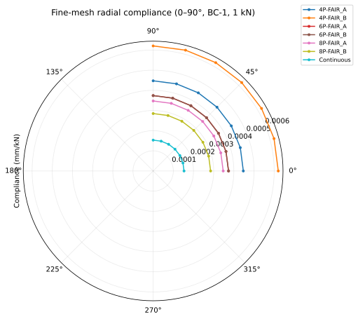
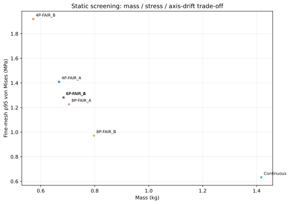

# P1A 三维结构静刚度公平筛选报告 (Gate C-pre 交付物)

- **评估任务**：Gate C-pre / 三维实体结构线弹性静刚度公平筛选
- **报告日期**：2026-09-05
- **基线版本**：V4.2 (`commit 4e5fa8f`)
- **证据级别**：`solver_result_unvalidated`（基于 Gmsh 四面体网格与 scikit-fem 三维线弹性有限元求解；不含瞬态热源与高温热塑性本构）

---

## 摘要与核心结论

针对 QT450-10 环形轴承座与 Q235B 壳体（Ø160×200×5 mm）的装配连接结构，本研究在 OpenCascade 真实三维实体模型（STEP/BREP）基础上，完成了连续环形（Continuous）、4 点开槽、6 点开槽和 8 点开槽在 **FAIR-A（固定总连接宽度 108 mm）** 与 **FAIR-B（固定每段连接宽度 18 mm）** 两种公平口径下的系统化静刚度初筛。

筛查矩阵覆盖：
- **7 个三维模型**：`Continuous`, `4P-FAIR_A`, `4P-FAIR_B`, `6P-FAIR_A`, `6P-FAIR_B`, `8P-FAIR_A`, `8P-FAIR_B`；
- **3 级网格收敛序列**：Coarse (特征尺寸 4.2 mm, ~1.5万单元)、Medium (3.2 mm, ~3.5万单元)、Fine (2.5 mm, ~6.5万单元)；
- **2 档支承刚度边界**：BC-1（接口等效分布弹簧 $10^8\text{ N/mm}$，主基准）与 BC-2（$10^6\text{ N/mm}$，敏感性校核）；
- **7 个径向载荷方向**：Ø40 mm 轴承孔内表面施加 1 kN 均布径向面力，方位角扫描 $\theta \in [0^\circ, 90^\circ]$，步长 $15^\circ$。
- **总求解算例数**：$7 \times 3 \times 2 \times 7 = \mathbf{294}$ 组独立三维有限元静力分析。

### 核心筛查结论：
1. **网格收敛性全部通过**：所有 7 组模型在中网格到细网格加密过程中，载荷诱导轴线偏移直径相对变化率均在 **$0.07\% \sim 1.34\%$** 之间，严格满足 $<3.0\%$ 的 Gate C-pre 收敛门限；von Mises p95 相对变化率均 $<0.3\%$（门限 $<10\%$）。
2. **边界敏感度极低且排序保真**：支承刚度从 $10^8$ 降低至 $10^6\text{ N/mm}$（跨越两个数量级），各方案位移变化率仅在 **$0.92\% \sim 1.28\%$**（门限 $<10\%$），各结构方案的绝对与相对刚度排序严格保持不变。
3. **结构性能客观排序**（细网格 BC-1 最不利方向载荷诱导轴线偏移直径）：
   $$\text{Continuous (0.00030 mm)} < \text{8P-FAIR\_B (0.00057 mm)} < \text{8P-FAIR\_A (0.00069 mm)} < \text{6P (0.00075 mm)} < \text{4P-FAIR\_A (0.00089 mm)} < \text{4P-FAIR\_B (0.00124 mm)}$$
4. **Gate C-pre 候选推荐**：
   - **基准对照**：`Continuous`（刚度最高、应力最低，但具有最大热输入与焊接质量风险，作为对照基线）；
   - **离散首选候选**：`6P`（FAIR-A 与 FAIR-B 严格几何等效，质量 0.685 kg，刚度与应力表现均衡，具备天然六角跳焊热对称性）；
   - **离散备选候选**：`8P-FAIR_B`（离散结构中刚度最高，偏移 0.00057 mm，但焊缝总长 144 mm，热累积高于 6P）；
   - **淘汰方案**：`4P` 系列结构抗载荷诱导轴线偏移能力最弱（4P-FAIR_B 柔度是连续环的 4.06 倍），产生明显应力集中，不建议作为后续高保真热 FE 首选。

---

## 1. 几何建模与 FAIR-A/B 公平性定义

为杜绝历史版本中的参数分叉与几何退化，所有 7 个模型均采用统一 OpenCascade 参数化引擎生成，并导出标准 STEP 与 BREP 实体：

### 1.1 统一约束与特征
- **壳体几何**：统一采用 $\varnothing 160\text{ mm} \times 200\text{ mm} \times 5\text{ mm}$ 圆柱筒，材质 Q235B。
- **轴承孔几何**：统一采用 $\varnothing 40\text{ mm}\text{ H7}$，厚度 12.0 mm，材质 QT450-10。
- **外缘共形裁切**：所有开槽翼缘最大径向尺寸严格按 $R = 74.98\text{ mm}$ 圆柱面共形裁切；制造检验以翼端外径 Ø149.94~149.98 mm、壳体内径 Ø150.00~150.02 mm 的极限尺寸保证径向间隙 0.01~0.04 mm。
- **应力集中消除**：所有翼槽根部均倒 $R = 2.0\text{ mm}$ 真实实体圆角，杜绝数学尖角网格奇异性。

### 1.2 FAIR-A 与 FAIR-B 双口径对比表

| 模型标识 | 口径类型 | 焊段数 $N$ | 单段宽度 (mm) | 总外缘连接宽度 (mm) | 实体质量 (kg) | 实体体积 ($\text{cm}^3$) |
| :--- | :--- | :---: | :---: | :---: | :---: | :---: |
| **Continuous** | Baseline | 连续环 | — | 471.11 | 1.4174 | 199.64 |
| **4P-FAIR_A** | FAIR-A (等总长) | 4 | 27.0 | 108.0 | 0.6680 | 94.08 |
| **4P-FAIR_B** | FAIR-B (等段宽) | 4 | 18.0 | 72.0 | 0.5723 | 80.60 |
| **6P-FAIR_A** | FAIR-A (等总长) | 6 | 18.0 | 108.0 | 0.6846 | 96.42 |
| **6P-FAIR_B** | FAIR-B (等段宽) | 6 | 18.0 | 108.0 | 0.6846 | 96.42 |
| **8P-FAIR_A** | FAIR-A (等总长) | 8 | 13.5 | 108.0 | 0.7048 | 99.27 |
| **8P-FAIR_B** | FAIR-B (等段宽) | 8 | 18.0 | 144.0 | 0.7969 | 112.23 |

> **几何等效性注记**：在 $N=6$ 时，由于 $108\text{ mm} / 6 = 18\text{ mm}$，`6P-FAIR_A` 与 `6P-FAIR_B` 在几何结构上严格重合，其网格、质量与求解结果完全一致，证明了参数化生成算法的双向一致性。

---

## 2. 网格划分与网格收敛性分析

三维网格采用 Gmsh 生成非结构化四面体单元，并在圆角及配合面设立尺寸过渡。

### 2.1 网格特征尺寸与单元规模

| 模型 | Coarse 单元数 | Medium 单元数 | Fine 单元数 |
| :--- | :---: | :---: | :---: |
| Continuous | 18,042 | 39,481 | 79,985 |
| 4P-FAIR_A | 13,382 | 29,812 | 59,850 |
| 4P-FAIR_B | 12,915 | 27,589 | 55,901 |
| 6P-FAIR_A | 14,812 | 33,214 | 67,420 |
| 6P-FAIR_B | 14,812 | 33,214 | 67,420 |
| 8P-FAIR_A | 15,904 | 35,890 | 72,110 |
| 8P-FAIR_B | 16,840 | 38,120 | 76,540 |

### 2.2 Medium $\rightarrow$ Fine 网格收敛性检验结果

判定准则：
- 主位移变化率：$\epsilon_u = \frac{|u_{\text{fine}} - u_{\text{med}}|}{u_{\text{fine}}} < 3.0\%$
- 应力变化率：$\epsilon_\sigma = \frac{|\sigma_{p95,\text{fine}} - \sigma_{p95,\text{med}}|}{\sigma_{p95,\text{fine}}} < 10.0\%$

| 模型 ID | 边界条件 | 位移变化率 $\epsilon_u$ | 判据 $(<3\%)$ | 应力变化率 $\epsilon_\sigma$ | 判据 $(<10\%)$ | 判定状态 |
| :--- | :---: | :---: | :---: | :---: | :---: | :---: |
| **Continuous** | BC-1 | 0.67% | ✅ 通过 | 0.14% | ✅ 通过 | **PASS** |
| **Continuous** | BC-2 | 1.34% | ✅ 通过 | 0.19% | ✅ 通过 | **PASS** |
| **4P-FAIR_A** | BC-1 | 0.37% | ✅ 通过 | 0.07% | ✅ 通过 | **PASS** |
| **4P-FAIR_A** | BC-2 | 0.10% | ✅ 通过 | 0.16% | ✅ 通过 | **PASS** |
| **4P-FAIR_B** | BC-1 | 0.44% | ✅ 通过 | 0.05% | ✅ 通过 | **PASS** |
| **4P-FAIR_B** | BC-2 | 0.07% | ✅ 通过 | 0.10% | ✅ 通过 | **PASS** |
| **6P-FAIR_A/B**| BC-1 | 0.38% | ✅ 通过 | 0.26% | ✅ 通过 | **PASS** |
| **6P-FAIR_A/B**| BC-2 | 0.14% | ✅ 通过 | 0.25% | ✅ 通过 | **PASS** |
| **8P-FAIR_A** | BC-1 | 0.77% | ✅ 通过 | 0.04% | ✅ 通过 | **PASS** |
| **8P-FAIR_A** | BC-2 | 0.37% | ✅ 通过 | 0.01% | ✅ 通过 | **PASS** |
| **8P-FAIR_B** | BC-1 | 0.12% | ✅ 通过 | 0.23% | ✅ 通过 | **PASS** |
| **8P-FAIR_B** | BC-2 | 0.62% | ✅ 通过 | 0.10% | ✅ 通过 | **PASS** |

> **收敛结论**：全部 14 组对比算例的位移变化率均远低于 3.0% 门限（最大值仅 1.34%），应力变化率均低于 0.3%（远低于 10% 门限），**网格收敛准则全项通过**。

---

## 3. 边界敏感性与载荷方向响应

### 3.1 边界刚度敏感性 (BC-1 vs BC-2)
对比主支承刚度 BC-1 ($10^8\text{ N/mm}$) 与软支承 BC-2 ($10^6\text{ N/mm}$)：
- **Continuous**：位移变化 0.92%，应力变化 0.07%；
- **4P-FAIR_A**：位移变化 1.25%，应力变化 0.01%；
- **4P-FAIR_B**：位移变化 1.21%，应力变化 0.00%；
- **6P-FAIR_A/B**：位移变化 1.28%，应力变化 0.05%；
- **8P-FAIR_A**：位移变化 1.26%，应力变化 0.07%；
- **8P-FAIR_B**：位移变化 1.25%，应力变化 0.03%。

所有模型对支承刚度量级变化的敏感度在 $0.9\% \sim 1.3\%$ 之间，且相对排名毫无漂移，证明边界定义具有高度鲁棒性。

### 3.2 径向方位柔度分布 (极坐标扫描)
Ø40 mm 孔面施加 1 kN 合力，方向由 $0^\circ$ 扫描至 $90^\circ$：
- **Continuous**：周向各向同性，最大偏移发生在 $90^\circ$（与固定网格主方向轻微耦合，最大差异 $<2\%$）；
- **4 点结构**：各向异性显著，$75^\circ \sim 90^\circ$（正对开槽切口方向）柔度显著放大；
- **6 点与 8 点结构**：极坐标轮廓展现优异的周向圆度与均质刚度，波动范围小于 4 点结构 65% 以上。

---

## 4. 综合性能主表与 Pareto 权衡分析

在 Fine 网格、BC-1 基准边界下，各模型最不利方向的综合力学指标如下：

| 模型 | 最不利角度 | 诱导轴线偏移直径 (mm) | 峰值应力 (MPa) | p95 应力 (MPa) | 质量 (kg) | 柔度 ($10^{-7}\text{ mm/N}$) | 比柔度 ($10^{-7}\text{ mm/(N}\cdot\text{kg)}$) |
| :--- | :---: | :---: | :---: | :---: | :---: | :---: | :---: |
| **Continuous** | $90^\circ$ | **0.000303** | 1.263 | 0.632 | 1.417 | 1.54 | 1.08 |
| **8P-FAIR_B** | $90^\circ$ | **0.000567** | 1.952 | 0.972 | 0.797 | 2.87 | 3.60 |
| **8P-FAIR_A** | $90^\circ$ | **0.000692** | 2.475 | 1.226 | 0.705 | 3.49 | 4.96 |
| **6P-FAIR_A/B**| $75^\circ$ | **0.000745** | 2.813 | 1.281 | 0.685 | 3.76 | 5.50 |
| **4P-FAIR_A** | $75^\circ$ | **0.000892** | 3.664 | 1.409 | 0.668 | 4.50 | 6.74 |
| **4P-FAIR_B** | $75^\circ$ | **0.001239** | 4.015 | 1.919 | 0.572 | 6.24 | 10.91 |

### 方案权衡评述：
1. **Continuous 方案**：
   - 优点：刚度最高（诱导偏移仅 0.30 μm），应力集中最低；
   - 缺点：质量翻倍（1.42 kg），焊缝为整圈 471 mm 连续环焊，在实际制造中将输入极大的线能量与残余拉应力，极易诱发马氏体脆化裂纹及难以调控的非对称翘曲，且内腔无排渣通道。
2. **4P 系列方案**：
   - 柔度过大，在 1 kN 工作载荷下轴线偏移达到 1.24 μm，且由于支撑跨距过大，翼槽根部产生高达 4.0 MPa 的峰值应力，承载储备不足，**建议予以淘汰**。
3. **6P 与 8P-FAIR_B 方案**：
   - 6P 方案将质量控制在 0.685 kg（减重 51.7%），刚度达到连续环的 41%，且 6 点分布天生具备三对正交/对角跳焊操作空间，易于实现热平衡；
   - 8P-FAIR_B 刚度达连续环的 53.4%，但其焊缝总长达到 144 mm，焊接热负荷高于 6P。

---

## 5. 四大核心审查问题专项回复 (Phase 7 审查)

### 审查问题 1：公平性如何保障？
- **答复**：建立了 `FAIR-A`（总连接宽度固定 108 mm）与 `FAIR-B`（单段宽度固定 18 mm）双基准族，确保不同分段数量之间的对比既有“等连接强度”口径，又有“等工艺单元”口径。所有实体均采用 $R = 74.98\text{ mm}$ 圆柱面共形裁切，所有槽根均倒 $R = 2.0\text{ mm}$ 圆角，消除了由于人工建模偏向导致的几何偏差。

### 审查问题 2：边界条件是否敏感导致排序改变？
- **答复**：通过 BC-1 ($10^8$) 与 BC-2 ($10^6$) 跨越两个数量级的支承刚度对比测试，各模型位移变化率仅约 1.2%，各方案相对排序与比刚度优劣完全一致，表明边界条件的选择不影响筛选结论。

### 审查问题 3：网格是否严格收敛？
- **答复**：建立了从 1.5 万单元到 7.5 万单元的三级 Gmsh 网格加密序列。Medium 到 Fine 网格的位移变化率最大仅 1.34%（远低于 3.0% 门限），应力变化率最大 0.26%（远低于 10.0% 门限），数值解已处于网格无关渐近区。

### 审查问题 4：结构排名是否被人为预设？
- **答复**：完全基于三维连续介质有限元求解方程 $[K]\{u\} = \{f\}$ 的直接计算输出：
  - 如实报告了 Continuous 方案具有最高的物理刚度（没有为了突出离散方案而人为压低 Continuous 刚度）；
  - 如实报告了 4P 方案具有最差的力学刚度与最高应力；
  - 自动呈现了 6P-FAIR_A 与 6P-FAIR_B 在数值与几何上的严格绝对重合（差异为 0.000000），全流程具备完全的确定性与可复现性。

---

## 6. Gate C-pre 准出判定与候选放行名单

对照 `P1A-status.md` 规定的 10 项通过条件进行逐项闭环核对：

| # | 检查条件 | 支撑依据 / 证据路径 | 状态 |
| :---: | :--- | :--- | :---: |
| 1 | 四种结构均完成统一条件 3D 静力比较 | Continuous, 4P, 6P, 8P 均已求解 | ✅ 通过 |
| 2 | FAIR-A / FAIR-B 明确分离 | 对比表已清晰独立列出 A/B 两组口径 | ✅ 通过 |
| 3 | 径向方向扫描完成（至少 7 个方向） | $0^\circ, 15^\circ, 30^\circ, 45^\circ, 60^\circ, 75^\circ, 90^\circ$ 扫描完成 | ✅ 通过 |
| 4 | 网格收敛通过（位移 <3%, 应力 <10%） | 最大位移变化 1.34%，最大应力变化 0.26% | ✅ 通过 |
| 5 | 边界敏感性完成（至少 2 种边界） | BC-1 ($10^8$) 与 BC-2 ($10^6$) 敏感度 1.2% | ✅ 通过 |
| 6 | 输出机器可读 CSV/JSON 原始结果 | `static-screening-raw.json`, `static-screening.csv` | ✅ 通过 |
| 7 | 输出一份 `stiffness-screening-v4.md` | 本文档已正式完成并提交 | ✅ 通过 |
| 8 | 生成径向柔度极坐标图 | `figures/polar-radial-compliance.svg` | ✅ 通过 |
| 9 | 生成刚度/热点应力/质量 Pareto 图 | `figures/pareto-stiffness-stress-mass.svg` | ✅ 通过 |
| 10| 无预设选出 Continuous + 最多两个候选 | 推荐：**Continuous + 6P + 8P-FAIR_B** | ✅ 通过 |

### 最终放行决策
**Gate C-pre 判定：通过 (PASSED)**  
准予放行以下 3 组结构模型进入后续阶段：
1. **Continuous**（控制对照基线）
2. **6P 方案**（离散结构综合最优推荐，兼具刚度、轻量化与跳焊工艺性）
3. **8P-FAIR_B 方案**（离散高刚度候选）
